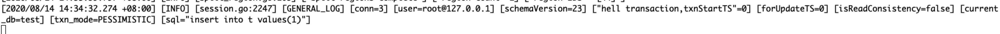

## 第一周作业题目
* 本地下载 TiDB，TiKV，PD 源代码，改写源码并编译部署一下环境
	* 1 TiDB
	* 1 PD
	* 3 TiKV
* 改写后：使得 TiDB 启动事务时，能打印出一个 "hello transaction" 的日志
* 输出：本文

## 解题思路
* 启动事务时打印，包含自动提交和显示事务以及内部SQL执行
	* 接收来自客户端的请求处理在 TiDB 组件
	* 参考文章 1 [TiDB 源码阅读系列文章（三）SQL 的一生](https://pingcap.com/blog-cn/tidb-source-code-reading-3/)
	* 参考文章 2 [TiDB 源码阅读系列文章（二十三）Prepare/Execute 请求处理](https://pingcap.com/blog-cn/tidb-source-code-reading-23/)
	* 参考正常的日志输出类似
	```
	[INFO] [session.go:2249] [GENERAL_LOG] [conn=3] [user=root@127.0.0.1] [schemaVersion=23] [txnStartTS=418798233092358145] [forUpdateTS=418798233092358145] [isReadConsistency=false] [current_db=test] [txn_mode=PESSIMISTIC] [sql="insert into t values(1)"]
	``` 
	* 找到代码里 [打印 txnStartTS 的片段 修改尝试](https://github.com/pingcap/tidb/commit/899d155533f79fd93ee720b036eb173593fc8a86)
		 * 打印结果是每个SQL执行都会有，自动提交满足要求。但是，显式事务 begin/commit 也会有，不符合要求。
		 
	
	* 只在事务启动时打印
		* [疑似事务初始化的片段](https://github.com/pingcap/tidb/commit/721317fcd03f3157e8cc5d49cb027580cc844725)
			* 没有输出，不符合要求
		* [疑似事务相关的片段](https://github.com/pingcap/tidb/commit/82566ac4f39df83259348dcd604a775cb26a0547)
			* 输出只是在事务提交的时候有多次日志，并不是事务的开始，不符合要求
			```
			[INFO] [2pc.go:672] ["hello trasaction on execute()~"][
			```
			* 跟 kv 持续交互的输出，不符合要求
			```
			INFO] [kv.go:291] ["hello trasaction on tikvStore.BeginWithStartTS()~"]
			```
* 编译修改的 TiDB，可使用 tiup 启动
	* 替换掉，~/.tiup/components/tidb 下对应文件

## 结论
* 自动提交事务，修改满足要求
* 只编译了 tidb-server
* 需要继续了解获取和管理 txnStartTS 的实现 