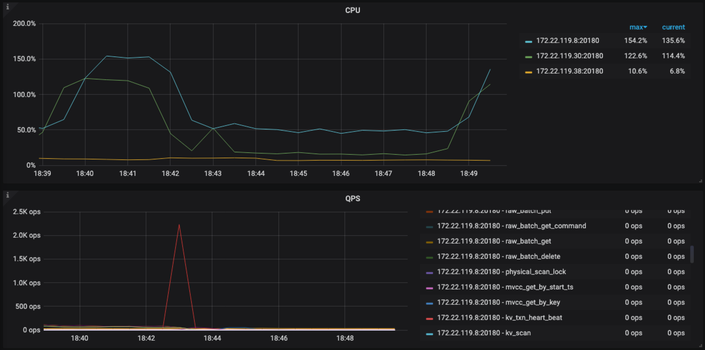

# HP-TiDB-homework-week-2
## TiDB 测试报告

### 测试目的

使用 sysbench、go-ycsb 和 go-tpc 分别对 TiDB 进行测试并且产出测试报告

### 测试版本、时间、地点

TiDB 版本：v4.0.4

时间：2020 年 8 月

地点：上海

### 测试环境

IDC 机器：

| 类别 | 名称 |
| :-: | :-: |
| OS | Linux Debian 4.9.110-3+deb9u1 (2018-08-03) x86_64 GNU/Linux) |
| CPU | 24 vCPUs, Intel Core Processor (Skylake) @ 2199.996Hz |
| RAM | 32GB |
| DISK | 528GB SSD |

使用 sysbench、go-ycsb 和 go-tpc 分别对 TiDB 进行测试
#### TiDB 版本信息

#### v4.0.4

| 组件 | GitHash |
| :-: | :-: |
| TiDB | c61fc7247e9f6bc773761946d5b5294d3f2699a5 |
| TiKV | 28e3d44b00700137de4fa933066ab83e5f8306cf |
| PD | 096ab27038530fcf674a9f9d872609ec2656ee73 |


#### TiDB 参数配置

默认配置

#### TiKV 参数配置

默认配置

#### 集群拓扑

| 机器 IP | 部署实例 |
| :-: | :-: |
| 172.22.119.8  | 1\*TiDB 1\*TiKV 1\*pd |
| 172.22.119.30 | 1\*TiDB 1\*TiKV 1\*pd |
| 172.22.119.38 | 1\*TiDB 1\*TiKV 1\*pd |


### 测试过程及结论

* sysbench
	* 创建数据库 
	* 导入数据之前先设置为乐观事务模式，导入结束后再设置回悲观模式
	
	```
	set global tidb_disable_txn_auto_retry = off; 
	set global tidb_txn_mode="optimistic"; 
	```
	
	* 导入数据
	
	```
	sysbench --mysql-host=172.22.119.8 --mysql-port=4000 --mysql-user=root --mysql-password=xxx --db-driver=mysql --table-size=100000 --tables=16 oltp_point_select prepare
   ```
	* 调整回悲观事务  
	
	```
	set global tidb_txn_mode="pessimistic" ;
	```
	
	* Point select 测试
		- 存在热点问题，压力分布不均匀，压力都在 172.22.119.20:20160 这个节点，数据量小，没有明显性能瓶颈
	
	```
	sysbench --config-file=sysbench.conf oltp_point_select --threads=128 --tables=16 --table-size=100000 run
	SQL statistics:
    queries performed:
        read:                            32765776
        write:                           0
        other:                           0
        total:                           32765776
    transactions:                        32765776 (54608.35 per sec.)
    queries:                             32765776 (54608.35 per sec.)
    ignored errors:                      0      (0.00 per sec.)
    reconnects:                          0      (0.00 per sec.)

	General statistics:
    	total time:                          600.0119s
    	total number of events:              32765776

	Latency (ms):
         min:                                    0.31
         avg:                                    2.34
         max:                                  208.37
         95th percentile:                        4.33
         sum:                             76782078.31

	Threads fairness:
    	events (avg/stddev):           255982.6250/223.80
    	execution time (avg/stddev):   599.8600/0.00
	```
	
	
	
	
	
	* Update index 测试命令
		- 存在热点问题，压力分布不均匀，压力大部分在 172.22.119.20:20160 这个节点，QPS只有1.7K，相比点查（55.9k）低很多。耗时主要在事务锁相关，kv\_pessimistic\_lock / kv\_batch\_rollback / kv\_check\_txn\_status
	
	```
	sysbench --config-file=sysbench.conf oltp_update_index --threads=128 --tables=16 --table-size=100000 run
	SQL statistics:
    queries performed:
        read:                            0
        write:                           959101
        other:                           0
        total:                           959101
    transactions:                        959101 (1598.02 per sec.)
    queries:                             959101 (1598.02 per sec.)
    ignored errors:                      0      (0.00 per sec.)
    reconnects:                          0      (0.00 per sec.)

	General statistics:
    	total time:                          600.1788s
    	total number of events:              959101

	Latency (ms):
         min:                                   24.46
         avg:                                   80.08
         max:                                 6482.55
         95th percentile:                      110.66
         sum:                             76803289.50

	Threads fairness:
    	events (avg/stddev):           7492.9766/30.33
    	execution time (avg/stddev):   600.0257/0.03
	```
	
	
	
	
	
	* Read-only 测试命令
		- 木有热点，QPS在 21K左右，大量交互在 kv\_batch\_get\_command，响应时间降低
		
	```
	sysbench --config-file=sysbench.conf oltp_read_only --threads=128 --tables=16 --table-size=100000 run
	SQL statistics:
    queries performed:
        read:                            10932264
        write:                           0
        other:                           1561752
        total:                           12494016
    transactions:                        780876 (1301.25 per sec.)
    queries:                             12494016 (20819.94 per sec.)
    ignored errors:                      0      (0.00 per sec.)
    reconnects:                          0      (0.00 per sec.)

	General statistics:
    	total time:                          600.0963s
    	total number of events:              780876

	Latency (ms):
         min:                                   19.56
         avg:                                   98.36
         max:                                  343.60
         95th percentile:                      134.90
         sum:                             76803619.01

	Threads fairness:
    	events (avg/stddev):           6100.5938/16.54
    	execution time (avg/stddev):   600.0283/0.03
	```
	
	
	
	
	
* go-ycsb
	* load & run
	
	```
	./bin/go-ycsb load mysql -P workloads/workloada -p recordcount=100000 -p mysql.host=172.22.119.8 -p mysql.port=4000 --threads 128
	./bin/go-ycsb run mysql -P workloads/workloada -p operationcount=100000 -p  mysql.host=172.22.119.8 -p mysql.port=4000 --threads 128

	READ   - Takes(s): 0.6, Count: 431, OPS: 725.7, Avg(us): 21106, Min(us): 4887, Max(us): 57832, 99th(us): 57000, 99.9th(us): 58000, 99.99th(us): 58000
	UPDATE - Takes(s): 0.5, Count: 462, OPS: 907.9, Avg(us): 70333, Min(us): 6752, Max(us): 258436, 99th(us): 97000, 99.9th(us): 259000, 99.99th(us): 259000
	```
	
	* 负载类型
		* workloada，混合50%的读和50%的写，QPS 1.5K+ 压力不明显，写操作耗时在锁相关部分
		
		
		
		

		* workloadf，Read-modiy-wirte，读数据并改写，QPS 2.2K+  压力不明显，写操作耗时在锁相关部分
		
		```
		READ   - Takes(s): 0.5, Count: 896, OPS: 1834.8, Avg(us): 14879, Min(us): 4953, Max(us): 46175, 99th(us): 44000, 99.9th(us): 47000, 99.99th(us): 47000
		READ_MODIFY_WRITE - Takes(s): 0.4, Count: 410, OPS: 1109.3, Avg(us): 70950, Min(us): 41878, Max(us): 131613, 99th(us): 125000, 99.9th(us): 132000, 99.99th(us): 132000
		UPDATE - Takes(s): 0.4, Count: 410, OPS: 1108.4, Avg(us): 55622, Min(us): 34428, Max(us): 98050, 99th(us): 90000, 99.9th(us): 99000, 99.99th(us): 99000
		```
		
		
		
		
		
* go-tpc
	* 准备数据
	
	```
	./bin/go-tpc tpcc -H 172.22.119.8 -P 4000  -p xxx  -D sbtest --warehouses 10 prepare
	```
	
	* 运行测试，QPS 200+，压力不明显，grpc耗时在事务重试部分
	
	```
	./bin/go-tpc tpcc -H 172.22.119.8 -P 4000 -D tpcc --warehouses 10 run
	[Summary] DELIVERY - Takes(s): 1683.0, Count: 264, TPM: 9.4, Sum(ms): 175265, Avg(ms): 663, 90th(ms): 1000, 99th(ms): 1500, 99.9th(ms): 2000
	[Summary] NEW_ORDER - Takes(s): 1687.8, Count: 3063, TPM: 108.9, Sum(ms): 911062, Avg(ms): 297, 90th(ms): 512, 99th(ms): 1000, 99.9th(ms): 1000
	[Summary] NEW_ORDER_ERR - Takes(s): 1687.8, Count: 1, TPM: 0.0, Sum(ms): 105, Avg(ms): 105, 90th(ms): 112, 99th(ms): 112, 99.9th(ms): 112
	[Summary] ORDER_STATUS - Takes(s): 1674.0, Count: 282, TPM: 10.1, Sum(ms): 16428, Avg(ms): 58, 90th(ms): 96, 99th(ms): 160, 99.9th(ms): 512
	[Summary] PAYMENT - Takes(s): 1688.2, Count: 3006, TPM: 106.8, Sum(ms): 565680, Avg(ms): 188, 90th(ms): 256, 99th(ms): 512, 99.9th(ms): 1000
	[Summary] STOCK_LEVEL - Takes(s): 1687.2, Count: 291, TPM: 10.3, Sum(ms): 16323, Avg(ms): 56, 90th(ms): 96, 99th(ms): 160, 99.9th(ms): 512
	tpmC: 108.9
	```
	
	
	
	
	* 导入数据
	
	```
	./bin/go-tpc tpch prepare -H 172.22.119.8 -P 4000 -D tpch --sf 10 --analyze
	```
	
	* 运行测试，明显耗时在 coprocessor 以及事务回滚部分
	
	```
	./bin/go-tpc tpch run -H 172.22.119.8 -P 4000 -D tpch --sf 10
	
	[Summary] Q1: 15.12s
	[Summary] Q10: 24.14s
	[Summary] Q11: 3.29s
	[Summary] Q12: 7.77s
	[Summary] Q13: 10.11s
	[Summary] Q14: 6.27s
	[Summary] Q15: 11.68s
	[Summary] Q16: 4.17s
	[Summary] Q17: 21.60s
	[Summary] Q2: 6.66s
	[Summary] Q3: 16.07s
	[Summary] Q4: 4.50s
	[Summary] Q5: 18.08s
	[Summary] Q6: 5.68s
	[Summary] Q7: 6.66s
	[Summary] Q8: 8.04s
	[Summary] Q9: 81.08s
	```
	
	
	
	

